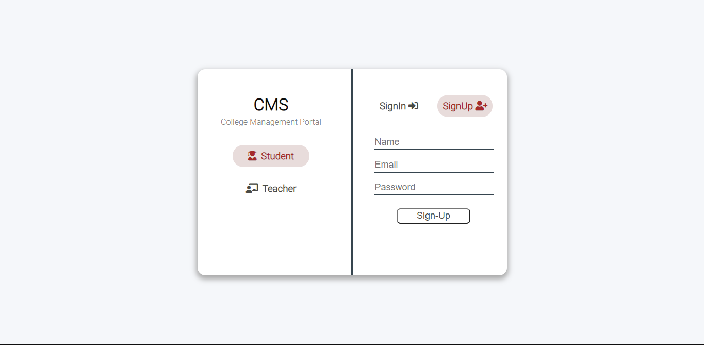
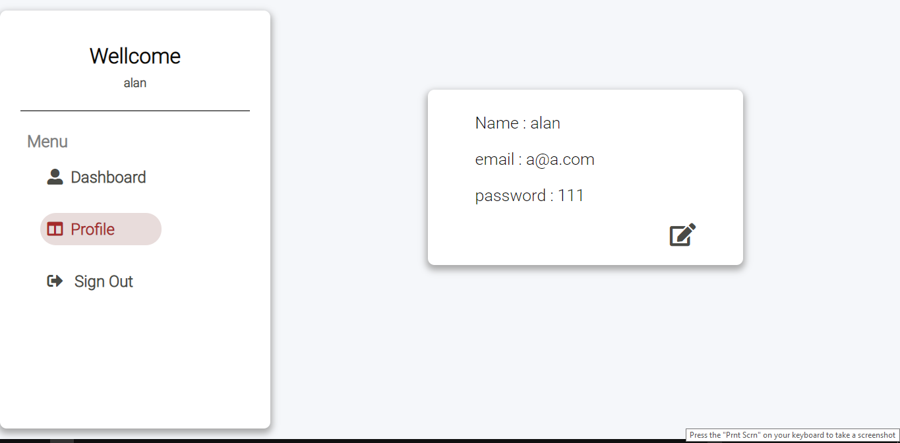
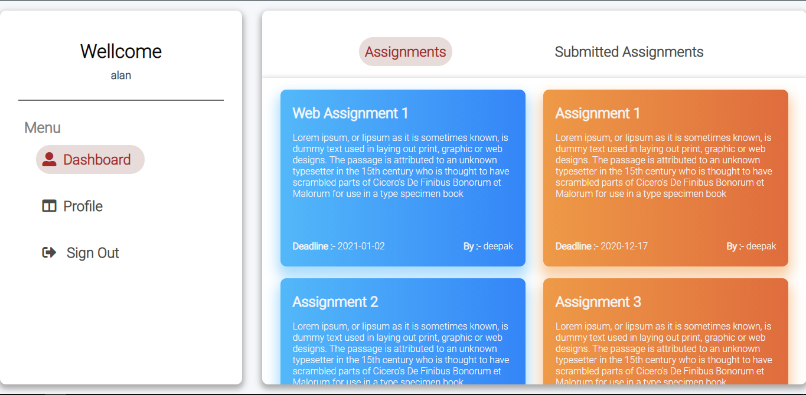
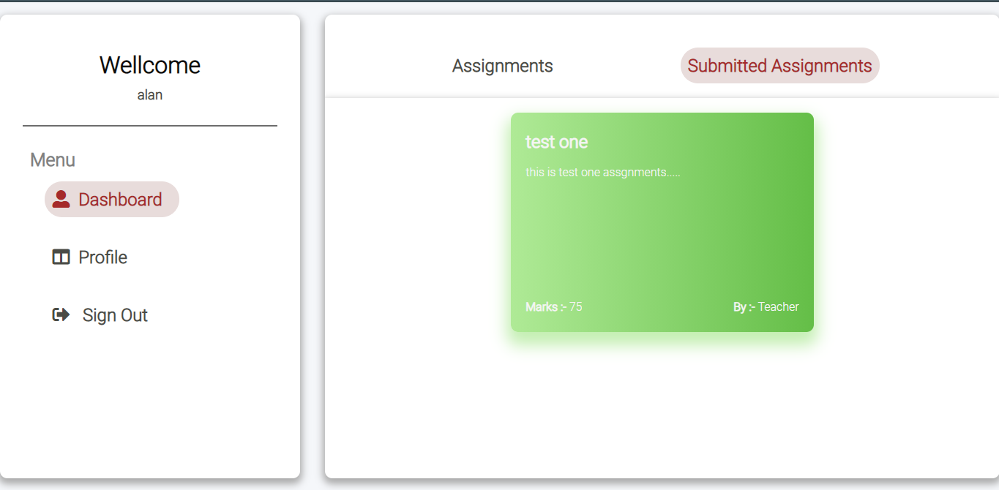
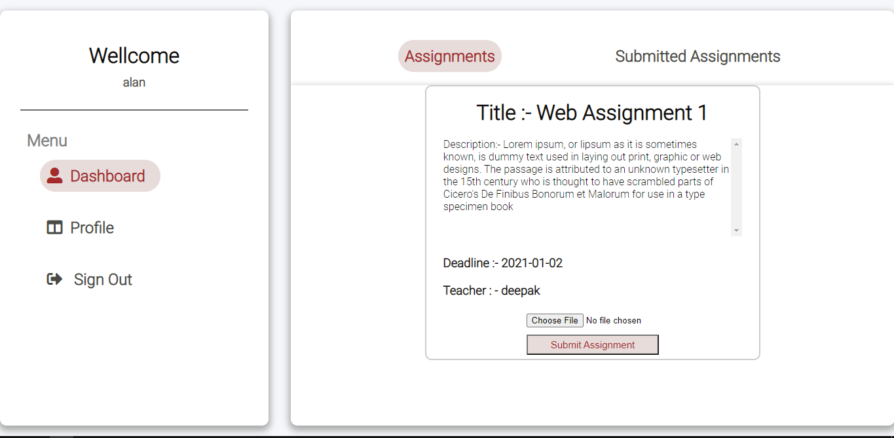
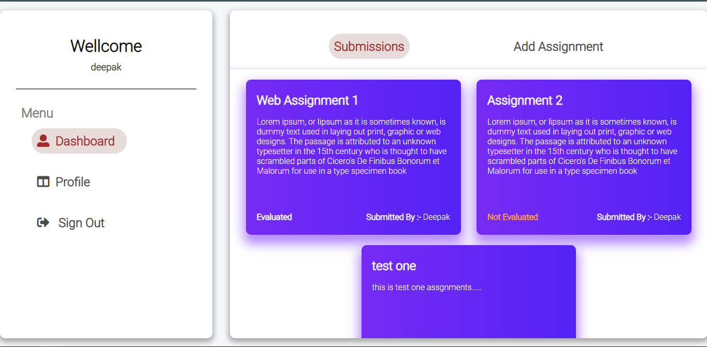
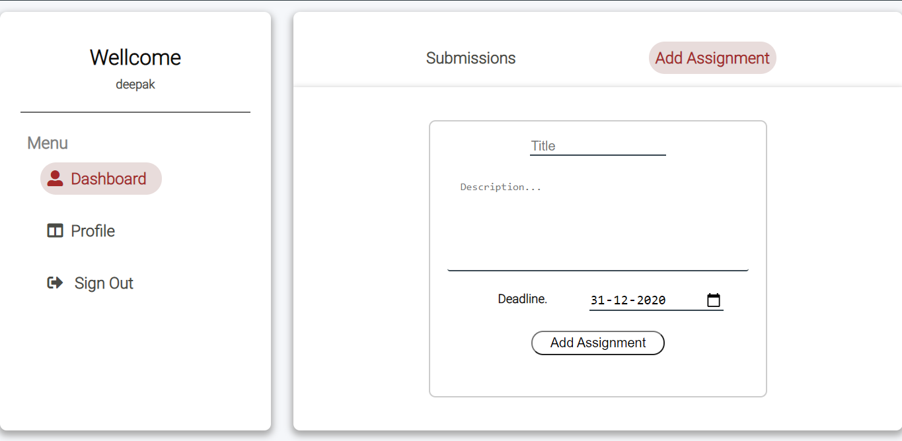
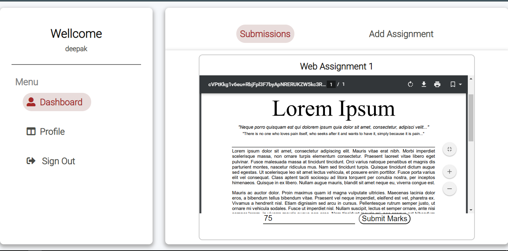

# College Management Portal
FullStack application created using NODEJS( backend ) and REACT( frontend ).
## [`College-Management-Portal Frontend github`](https://github.com/Devilzer/college-management-portal-frontend)
## [`College-Management-Portal Backend github`](https://github.com/Devilzer/college-management-portal-backend)

## Features

* User can register/login as student or teacher.
* Profile page to edit their information from here. Like passwords, name, email.
* Different dashboard for students and teachers.
* Assignments color coded according to deadline and submission in Student Dashboard.
* PDF assignment submission for students.
* Students can view their submissions in Submitted Assignments tab (along with the grades if assigned by the teacher).
* Add Assignment : A teacher can add assignments with deadlines, title, description.
* A teacher can view the submissions of all the assignments.
* Assignment evaluation :A teacher can view all the submissions and give a grade for each submission for a particular assignment.
* Once evaluated, students should be able to see their grades in their Submitted Assignments section.

## How to install and run?
### client( front-end )
1. Clone the frontend form above link.
2. Install all dependencies by `npm install`
3. `npm start`

### server( back-end )
1. Clone the backend form above link.
2. Install all dependencies by `npm install`
3. Config MongoDB by adding your db connect url in `/config/mongoose.js`
4. `npm start`

## App Overview.

#### Sign-in/Sign-up page.

User can register/login as student or teacher.
 

#### User Profile page.
User can edit profile information here.
 

### Student Dashboard.

#### Assignments.
Assignments color coded according to dead line (blue: Deadline not passed, orange: Deadline passed).
 

#### Submitted Assignments.
Shows all assigments submitted by student and Marks obtained.
 

#### Assignment Submission.
Student can submit their assignment (upload a pdf file).
 

### Teacher Dashboard.

#### Submissions.
All the assignment submitted by students.
 

#### Add Assignment.
 

#### Assignment evaluation.
Teacher can view ( pdf rendered ) assignment uploaded by student and grade it.
 

## Directory Structure

### Frontend
`components` Contains all the React components. 
`redux` Contains Redux State mangement files (acitons,reducers). 
`style` Contains SCSS file for App styling. 

### Backend
This project follows MVC Structure. 
`config` Contains config files for js libries used in project. 
`controllers` Contains functions for controlling the api endpoints. 
`models` Contains different database models. 
`routes` Contains all routes.
